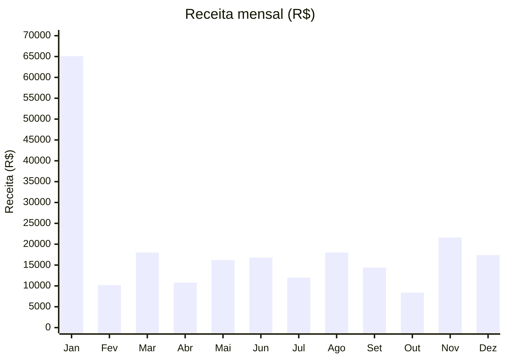
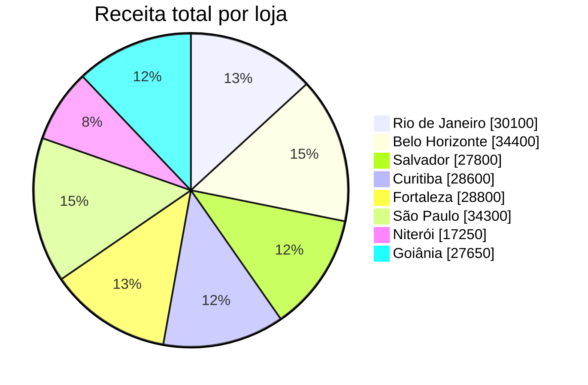

# SQL Analytics Project – E-commerce Simulation

Projeto educacional de SQL e Data Analytics baseado em um banco fictício de
e-commerce. O objetivo é demonstrar, de forma progressiva, modelagem
relacional, consultas analíticas, solução de problemas de negócio e fundamentos
de Data Warehouse.

> Educational SQL and Data Analytics project based on a fictional e-commerce
> database. It progressively demonstrates relational modeling, analytical
> queries, business problem solving and Data Warehouse fundamentals.

## Tecnologias

- MySQL 8.0+
- SQL
- Modelo relacional
- Modelagem dimensional (Star Schema)
- ETL com stored procedure

## Dados

| Tabela | Descrição | Registros |
|---|---|---:|
| `categorias` | Categorias do catálogo | 7 |
| `clientes` | Perfil demográfico dos clientes | 100 |
| `locais` | Cidades, estados e regiões | 8 |
| `lojas` | Unidades comerciais | 8 |
| `produtos` | Produtos, preços e custos | 16 |
| `pedidos` | Histórico de vendas de 2019 | 374 |

Os dados são fictícios e destinados exclusivamente ao aprendizado.

## Visão geral dos dados

Os gráficos abaixo são baseados nos 374 pedidos disponíveis no projeto. As
consultas usadas para análises mais detalhadas estão em
`4_business_cases/01_sales_kpis.sql` e
`4_business_cases/02_store_performance.sql`.

### Receita mensal em 2019



### Participação da receita por loja



| Indicador | Resultado |
|---|---:|
| Receita total | R$ 228.900,00 |
| Pedidos analisados | 374 |
| Loja com maior receita | Belo Horizonte |
| Mês com maior receita | Janeiro |

## Estrutura

```text
.
├── 1_schema/
│   ├── 01_create_database.sql
│   └── 02_apply_constraints.sql
├── 2_basic_queries/
│   ├── select_basics.sql
│   ├── joins.sql
│   └── group_by.sql
├── 3_intermediate_queries/
│   ├── cte.sql
│   ├── subqueries.sql
│   └── window_functions.sql
├── 4_business_cases/
│   ├── 01_sales_kpis.sql
│   ├── 02_store_performance.sql
│   ├── 03_product_analysis.sql
│   └── 04_customer_analysis.sql
├── 5_data_engineering_simulation/
│   ├── 01_star_schema.sql
│   ├── 02_etl_load.sql
│   └── 03_dw_analytics.sql
├── database/                  # Dumps com os dados brutos
├── docs/
│   ├── data_model.md
│   └── expected_results.md
├── tests/
│   └── validation.sql
└── install.sql
```

## Instalação

Pré-requisito: MySQL 8.0 ou superior.

Na raiz do projeto, execute:

```bash
mysql -u root -p < install.sql
```

O instalador:

1. recria o banco `ecommerce_analytics`;
2. importa os dados brutos;
3. aplica tipos adequados, chaves, restrições e índices;
4. cria o modelo estrela;
5. executa a carga inicial do Data Warehouse.

> Atenção: `install.sql` remove e recria o banco `ecommerce_analytics`.

## Executando as análises

```bash
mysql -u root -p ecommerce_analytics < 2_basic_queries/select_basics.sql
mysql -u root -p ecommerce_analytics < 3_intermediate_queries/window_functions.sql
mysql -u root -p ecommerce_analytics < 4_business_cases/01_sales_kpis.sql
mysql -u root -p ecommerce_analytics < 5_data_engineering_simulation/03_dw_analytics.sql
```

## Validação

Após a instalação:

```bash
mysql -u root -p < tests/validation.sql
```

O teste verifica volumes, integridade referencial, consistência financeira,
carga do modelo dimensional e reconciliação entre origem e Data Warehouse.

## Habilidades demonstradas

- `SELECT`, `WHERE`, `ORDER BY` e `LIMIT`
- `INNER JOIN` e `LEFT JOIN`
- `GROUP BY`, funções de agregação e `HAVING`
- subconsultas e CTEs
- `RANK`, `DENSE_RANK`, `LAG` e médias móveis
- KPIs de receita, custo, lucro, margem e ticket médio
- análise de lojas, produtos, categorias e clientes
- tipos de dados, PKs, FKs, constraints e índices
- modelagem dimensional com dimensões e tabela fato
- ETL transacional, idempotência e auditoria
- reconciliação e testes de qualidade de dados

## Modelo de dados

Consulte [docs/data_model.md](docs/data_model.md) para os diagramas do modelo
relacional e do Data Warehouse.

## Autor

Alan Kordel  
Computer Engineering Student | Data & BI Focus  
Estudante de Engenharia da Computação | Foco em Dados e BI
