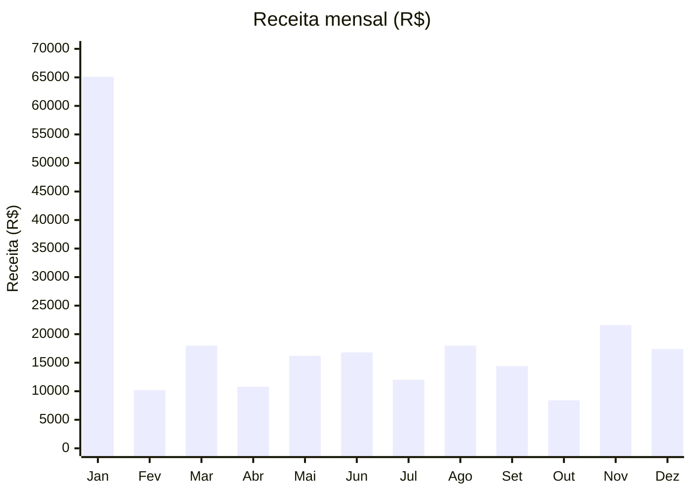
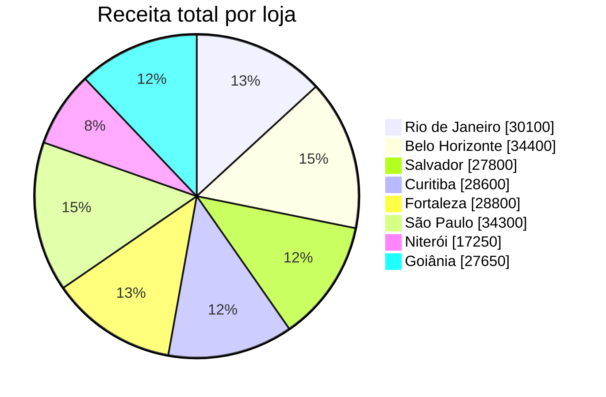
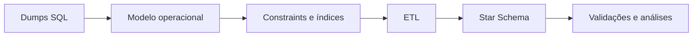

# SQL Analytics Project – E-commerce Simulation

[](https://github.com/alankordel/sql-analytics-ecommerce-simulation/actions/workflows/sql-validation.yml)

Projeto educacional de SQL e Data Analytics baseado em um banco fictício de
e-commerce. O objetivo é demonstrar, de forma progressiva, modelagem
relacional, consultas analíticas, solução de problemas de negócio, fundamentos
de Data Warehouse e validação automatizada.

> Educational SQL and Data Analytics project based on a fictional e-commerce
> database, with a reproducible MySQL 8 environment and automated data-quality
> validation.

## Tecnologias

- MySQL 8.0
- Docker e Docker Compose
- SQL
- Modelo relacional
- Modelagem dimensional (Star Schema)
- ETL com stored procedure
- GitHub Actions

## Dados

| Tabela | Descrição | Registros |
|---|---|---:|
| `categorias` | Categorias do catálogo | 7 |
| `clientes` | Perfil demográfico dos clientes | 100 |
| `locais` | Cidades, estados e regiões | 8 |
| `lojas` | Unidades comerciais | 8 |
| `produtos` | Produtos, preços e custos | 16 |
| `pedidos` | Histórico de vendas de 2019 | 374 |

Os dados são fictícios e destinados exclusivamente ao aprendizado.

## Visão geral dos dados

Os gráficos são baseados nos 374 pedidos disponíveis. As consultas detalhadas
estão em `4_business_cases/`.

### Receita mensal em 2019



### Participação da receita por loja



| Indicador | Resultado |
|---|---:|
| Receita total | R$ 228.900,00 |
| Pedidos analisados | 374 |
| Loja com maior receita | Belo Horizonte |
| Mês com maior receita | Janeiro |

## Pipeline do projeto



O `install.sql` recria o banco, importa os dumps sem modificá-los, aplica a
modelagem relacional, cria o Star Schema e executa a carga inicial. Em seguida,
`tests/validation.sql` verifica regras de qualidade, integridade, reconciliação
e idempotência.

> **Atenção:** `install.sql` executa `DROP DATABASE` e recria completamente o
> banco `ecommerce_analytics`. Use-o somente no ambiente de desenvolvimento.

## Modelo operacional e Star Schema

O modelo operacional preserva clientes, produtos, lojas, localidades,
categorias e pedidos em tabelas normalizadas. Ele representa as entidades e os
relacionamentos da operação.

O Star Schema reorganiza os mesmos dados para análise: `fato_vendas` concentra
as medidas e se relaciona com `dim_data`, `dim_cliente`, `dim_produto` e
`dim_loja`. Como `ID_Pedido` é único na fonte, o grão da fato é **uma linha por
pedido ou transação**, e não uma linha por item de pedido.

O ETL atual atualiza as dimensões e realiza **full refresh** da tabela fato:
remove todas as linhas de `fato_vendas` e recarrega os pedidos. O processo é
transacional, auditado e testado para ser idempotente.

Consulte [docs/data_model.md](docs/data_model.md) para os diagramas completos.

## Requisitos

Para o caminho recomendado:

- Docker Desktop no Windows ou Docker Engine no Linux;
- Docker Compose v2 (`docker compose`);
- Git.

Para a instalação manual alternativa:

- MySQL Server e cliente MySQL 8.0+;
- terminal aberto na raiz do repositório.

## Execução com Docker no Windows PowerShell

### 1. Preparar as variáveis locais

```powershell
Copy-Item .env.example .env
```

Edite `.env` e defina senhas exclusivas para seu ambiente. Esse arquivo é
ignorado pelo Git.

### 2. Subir o banco e aguardar o healthcheck

```powershell
docker compose up -d --wait mysql
docker compose ps
```

### 3. Instalar o projeto

```powershell
.\scripts\install.ps1
```

### 4. Executar as validações

```powershell
.\scripts\validate.ps1
```

### 5. Remover o ambiente

```powershell
docker compose down
```

Para também apagar o volume e recriar o banco do zero na próxima execução:

```powershell
docker compose down --volumes
```

## Execução com Docker no Bash/Linux

```bash
cp .env.example .env
# Edite .env antes de continuar.

docker compose up -d --wait mysql
docker compose ps
docker compose exec -T mysql bash /workspace/scripts/install.sh
docker compose exec -T mysql bash /workspace/scripts/validate.sh
docker compose down
```

Para remover também os dados persistidos:

```bash
docker compose down --volumes
```

## Instalação manual

Com MySQL 8 em execução, abra o terminal na raiz do repositório:

```bash
mysql -u root -p < install.sql
mysql -u root -p < tests/validation.sql
```

Os comandos precisam ser executados na raiz porque `install.sql` utiliza
diretivas `SOURCE` com caminhos relativos.

## Executando as análises

Com Docker:

```bash
docker compose exec -T mysql bash -c \
  'cd /workspace && mysql -uroot -p"$MYSQL_ROOT_PASSWORD" ecommerce_analytics < 4_business_cases/01_sales_kpis.sql'
```

Com cliente MySQL local:

```bash
mysql -u root -p ecommerce_analytics < 2_basic_queries/select_basics.sql
mysql -u root -p ecommerce_analytics < 3_intermediate_queries/window_functions.sql
mysql -u root -p ecommerce_analytics < 4_business_cases/01_sales_kpis.sql
mysql -u root -p ecommerce_analytics < 5_data_engineering_simulation/03_dw_analytics.sql
```

## Validações automatizadas

A suíte verifica:

- volumes esperados e integridade referencial;
- fórmulas de receita e custo;
- valores não negativos, quantidade positiva e período de venda;
- chaves naturais únicas nas dimensões;
- correspondência entre fato e dimensões;
- ausência de pedidos duplicados na fato;
- reconciliação de receita e custo entre origem e Data Warehouse;
- status da última execução do ETL;
- idempotência após duas execuções consecutivas do ETL.

O workflow `.github/workflows/sql-validation.yml` executa automaticamente em
pushes para `evolucao/ambiente-reproduzivel`, Pull Requests destinados à
`main` e acionamentos manuais.

## Estrutura

```text
.
├── .github/workflows/sql-validation.yml
├── 1_schema/
├── 2_basic_queries/
├── 3_intermediate_queries/
├── 4_business_cases/
├── 5_data_engineering_simulation/
├── database/                         # Dumps brutos preservados
├── docs/
├── scripts/
│   ├── install.ps1
│   ├── install.sh
│   ├── validate.ps1
│   └── validate.sh
├── tests/validation.sql
├── .env.example
├── docker-compose.yml
└── install.sql
```

## Limitações conhecidas

- A base contém somente 374 pedidos, sendo adequada para demonstração, mas não
  para testes de escala.
- As vendas apresentam forte concentração em um único produto.
- Existem poucas variações na quantidade vendida por pedido.
- Os dados estão restritos ao ano de 2019.
- A tabela fato utiliza full refresh em cada execução do ETL.
- Ainda não existe estratégia de carga incremental ou histórico de alterações
  nas dimensões.
- Os dados são fictícios e possuem finalidade exclusivamente educacional.

O modelo atual também assume uma transação por `ID_Pedido`. Suporte a múltiplos
itens por pedido exigiria uma nova chave para a linha do pedido e está fora do
escopo desta evolução.

## Habilidades demonstradas

- consultas SQL básicas, intermediárias e analíticas;
- modelagem relacional e dimensional;
- KPIs de vendas, lojas, produtos e clientes;
- ETL transacional, idempotência e auditoria;
- testes de qualidade e reconciliação;
- ambiente reproduzível com Docker;
- integração contínua com GitHub Actions.

## Autor

Alan Kordel<br>
Computer Engineer | Data & BI Focus<br>
Engenheiro da Computação | Foco em Dados e BI
