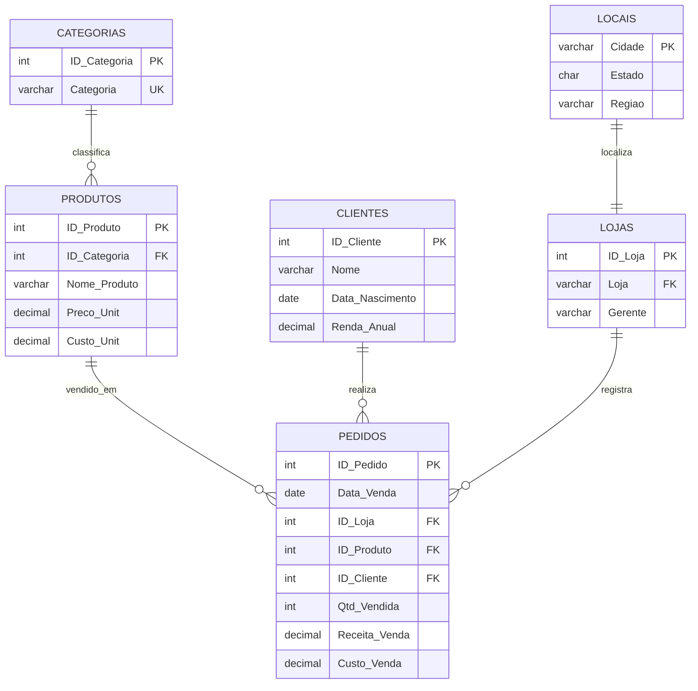
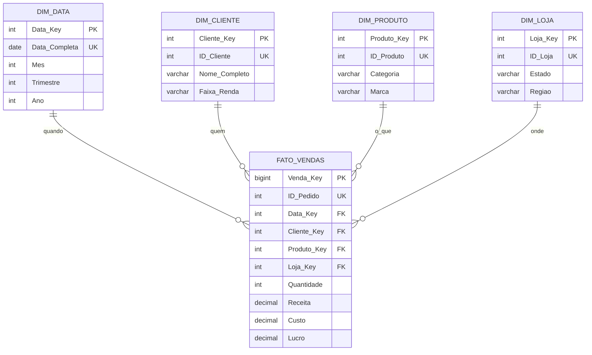

# Data Models

## Operational relational model

The source model represents the e-commerce operation. `pedidos` is the central
transaction table and references customer, product and store master data.

## Analytical star schema

The fact grain is one order row. Surrogate dimension keys decouple analytics
from operational identifiers. Profit is calculated as a generated measure.

